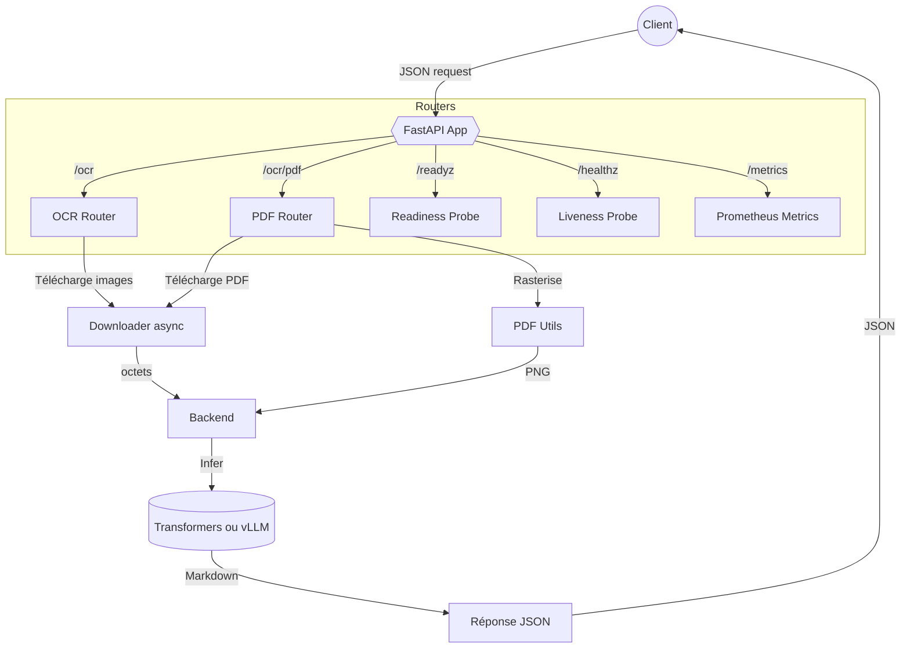

# DeepSeek OCR API

API FastAPI "prod-ready" pour orchestrer le modèle [`deepseek-ai/DeepSeek-OCR`](https://huggingface.co/deepseek-ai/DeepSeek-OCR) avec deux backends interchangeables (Transformers et vLLM), gestion de la concurrence, probes K8S et métriques Prometheus.

## Fonctionnalités clés

- **Backends interchangeables** : `BACKEND=transformers` (par défaut) ou `BACKEND=vllm`.
- **Endpoints prêts pour la prod** : `/ocr`, `/ocr/pdf`, `/healthz`, `/readyz`, `/metrics`.
- **Contrôle de la concurrence** via sémaphore asynchrone (`MAX_CONCURRENCY`).
- **Prompts & presets** : prise en charge des tailles `tiny/small/base/large/gundam` et options de sampling.
- **Support PDF** (optionnel) basé sur `pypdfium2` + `Pillow` avec contrôle des pages.
- **Instrumentation Prometheus** prête pour Grafana via `prometheus-fastapi-instrumentator`.
- **Dockerfiles GPU & CPU** optimisés pour Torch 2.6 / CUDA 12.4.

## Installation locale

```bash
python -m venv .venv
source .venv/bin/activate
pip install -U pip
pip install -e .[pdf,transformers]  # ou ajouter [vllm] selon le backend souhaité
```

> ℹ️ `flash-attn` nécessite une machine Linux + GPU compatible. Pour CPU/dev, installez uniquement `[pdf]`.

## Lancer l'API

```bash
uvicorn app.main:app --host 0.0.0.0 --port 8000
```

ou

```bash
python -m app
```

### Variables d'environnement principales

| Variable | Par défaut | Description |
| --- | --- | --- |
| `BACKEND` | `transformers` | Backend d'inférence (`transformers` ou `vllm`). |
| `MODEL_ID` | `deepseek-ai/DeepSeek-OCR` | Modèle Hugging Face à charger. |
| `TORCH_DTYPE` | `bf16` | Précision pour le backend Transformers/vLLM. |
| `MAX_CONCURRENCY` | `2` | Nombre de requêtes concurrentes maximum. |
| `ENABLE_PDF_SUPPORT` | `1` | Active la conversion PDF→images (nécessite `pypdfium2`). |
| `PDF_MAX_PAGES` | `20` | Limite dure de pages converties par requête. |
| `METRICS_ENABLED` | `1` | Active `/metrics` (Prometheus). |
| `CORS_ALLOW_ORIGINS` | _(vide)_ | Liste CSV des origines autorisées.

## Exemples d'appels

### Image → Markdown

```bash
curl -s http://localhost:8000/ocr -H 'Content-Type: application/json' -d '{
  "prompt":"<image>\n<|grounding|>Convert the document to markdown.",
  "urls":["https://example.com/sample.png"],
  "mode":{"preset":"gundam"}
}' | jq -r '.results[0].text'
```

### PDF (pages 1–5)

```bash
curl -s http://localhost:8000/ocr/pdf -H 'Content-Type: application/json' -d '{
  "pdf_url":"https://example.com/report.pdf",
  "pdf_pages":{"page_from":1,"page_to":5,"dpi":180},
  "mode":{"preset":"base"}
}'
```

## Tests & lint

```bash
pip install -e .[develop]
pytest
ruff check app
```

## Conteneurs Docker

### GPU (Transformers par défaut)

```bash
docker build -t deepseek-ocr-api -f Dockerfile.gpu .
docker run --rm --gpus all -p 8000:8000 \
  -e BACKEND=transformers -e TORCH_DTYPE=bf16 deepseek-ocr-api
```

### CPU/dev (moins de dépendances)

```bash
docker build -t deepseek-ocr-api-dev -f Dockerfile.cpu .
docker run --rm -p 8000:8000 deepseek-ocr-api-dev
```

## Diagramme d'architecture



## Ressources complémentaires

- [Diagramme détaillé dans `docs/ARCHITECTURE.md`](docs/ARCHITECTURE.md)
- [Fiche Hugging Face officielle](https://huggingface.co/deepseek-ai/DeepSeek-OCR)
- [Documentation vLLM](https://docs.vllm.ai/)
- [Guide Prometheus FastAPI Instrumentator](https://github.com/trallard/prometheus-fastapi-instrumentator)
