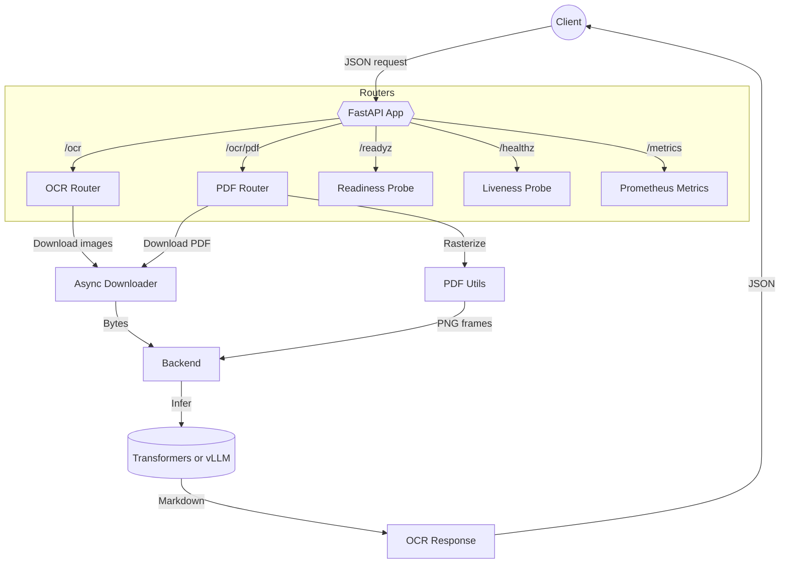

# Architecture

```mermaid
graph TD
    Client((Client)) -->|JSON request| FastAPI{{"FastAPI App"}}
    subgraph Routers
        FastAPI -->|/ocr| OCR[OCR Router]
        FastAPI -->|/ocr/pdf| PDF[PDF Router]
        FastAPI -->|/readyz| Ready[Readiness Probe]
        FastAPI -->|/healthz| Health[Liveness Probe]
        FastAPI -->|/metrics| Metrics[Prometheus Metrics]
    end
    OCR -->|Download images| HTTP[Async Downloader]
    PDF -->|Download PDF| HTTP
    PDF -->|Rasterize| PDFUtil[PDF Utils]
    HTTP -->|Bytes| Backend
    PDFUtil -->|PNG frames| Backend
    Backend -->|Infer| Engine[(Transformers or vLLM)]
    Engine -->|Markdown| Response[OCR Response]
    Response -->|JSON| Client
```
